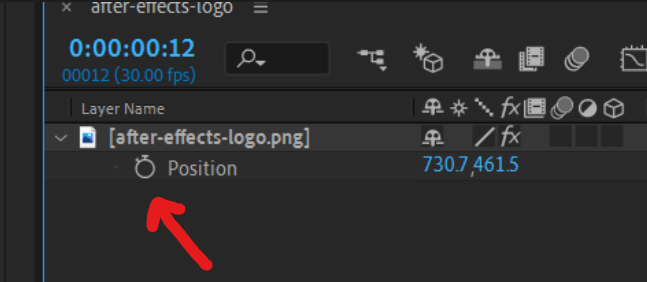

This is our goal:


## Create an expression

Add the element you want bouncing around to your composition
Find the position property (shortcut is `P`)
Hold `Alt/Option` and click the stopwatch to create an expression


## Paste in the code
Copy Paste this code into the expression window that appears:

```
// customize speed, position and offset here
var v = 400;     //velocity
var o = 0;       //time offset
var i = [800, 400]; //initial position

var f = (time+o) * v                  //function
var t = [i[0]+f, i[1]+f];             //time x/y
var d = thisLayer.sourceRectAtTime(); //dimensions
var s = transform.scale;              //scale
var lw = d.width *(s[1]/100);         //layer width
var lh = d.height*(s[0]/100);         //layer height
var w = thisComp.width - lw;          //screen width
var h = thisComp.height - lh;         //screen height

// cycle count in x and y
var c = [Math.floor(t[0]/w), Math.floor(t[1]/h)];

// position in cycle for x and y
var p = [t[0] % w, t[1] % h]

//     cycle isOdd ? inversed : original      
var x = c[0] %2==1 ? w - p[0] : p[0];
var y = c[1] %2==1 ? h - p[1] : p[1];

[x + lw/2, y + lh/2]
```