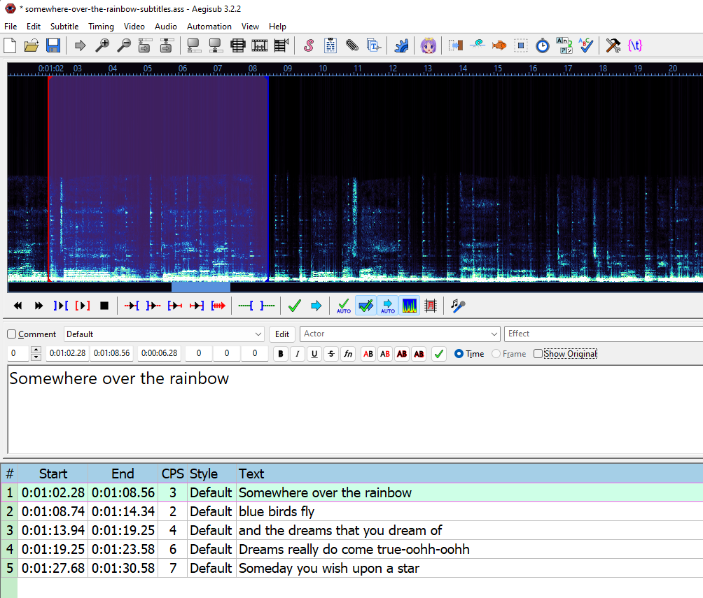

Lyrics video text implemented automatically in after effects.  
Using a pre-made file with all automation setup.  

We will also discuss how to sync your lyrics.


Here is how it will look like:


## Download pre-made After Effects file


After Effects file: **[Download]()**

This file includes all the automation required for synced lyrics.

Drag and drop the downloaded file into your After Effect project. 


## Add your lyrics
This is the format the after effects file uses.

Further down are more details on how to generate these lyrics.

**Example lyrics text:**
```json
{
  "lyrics": {
    "lines": [
      {
        "startTimeMs": "37310",
        "words": "Somewhere over the rainbow",
        "endTimeMs": "0"
      },
      {
        "startTimeMs": "44250",
        "words": "Way up high",
        "endTimeMs": "0"
      },
      {
        "startTimeMs": "48190",
        "words": "And the dreams that you dream of",
        "endTimeMs": "0"
      }
  }
}
```

**How to import lyrics data in project:**

- Open the pre-made after effects file you downloaded
- Select all the lyrics text data
- Copy it
- Delete "REPLACE ME WITH YOUR LYRIC DATA"
- Paste your lyrics text there


## How to view spotify HTTP requests  

First go to [open.spotify.com](https://open.spotify.com/) and find any song you want to play
 
- Open dev tools with CTRL/CMD + SHIFT + I  
- Click "Network" in the top tabs  
- You can filter results, for example "color"
- Refresh the browser window  
- To view a request right click it under "Name"  
- Click Copy > Copy Response


**Notice!**  
This information is for educational purposes only. 
In this example we see how to view HTTP requests trough the browser. We learned how to filter those results and view the data.  

Make sure to always follow [Spotifys Terms of service](https://www.spotify.com/us/legal/end-user-agreement/)


## Using .srt file to import lyrics

SRT is a common file format for subtitles.  
If you have the song lyrics in SRT file format you can convert them to the JSON lyrics data format that his After Effects project uses.  

**Use the online .SRT 2 JSON converter:**  
Link: [SRT to After Effects JSON website](https://jesper-hustad.github.io/Srt2Json/)


## Generate your own .srt file  

In the future there may be better alternatives for generating an SRT file for your song (possibly automatically). So you may try looking around. But here are two simple ways to generate your own lyrics data:


**YouTube:**  
You can use the captioning services available on YouTube. If you only have audio [convert your mp3 to mp4](https://www.onlineconverter.com/audio-to-video).

1. Upload your song to YouTube  

2. [Add subtitles to your YouTube video](https://support.google.com/youtube/answer/2734796?hl=en#zippy=%2Cauto-sync) (try Auto-sync!)

3. Download subtitles as .srt file and use [SRT to After Effects JSON website](https://jesper-hustad.github.io/Srt2Json/)


**How to download YouTube subtitles as srt:**


__________
**Free subtitling software (available on all platforms)**

If you are more serious and want better control you can use the free and open source subtitle software Aegisub.

[Download Aegisub](https://aegisub.org/downloads/)



I actually found it pretty intuitive to use.  


**Import your song:**  
  `Audio > Open Audio File...`

**Add subtitles:**
Select Timeframe in audio window > write the subtitle > hit `ENTER`.

**Tip:** Right click a subtitle and select "Make time continuous" to extend it to the next subtitle.

**Tutorial:** The user base of this program is seemingly 90% k-pop fans so this was the [best tutorial I could find](https://www.youtube.com/watch?v=ylDadX3y95A). Ignore the sections relating to video and fonts.


**Exporting:** After you are done press File > Export Subtitles... > Export... > Set "Save as type" to .srt > Save and use [SRT to After Effects JSON website](https://jesper-hustad.github.io/Srt2Json/)


## Customizing the lyrics effect  
After you have imported the lyrics here is how to edit the effect.

Select the `LYRICS TEXT CONTROLLER` and look at the effects.


**Fade Duration:** Time spent fading between lyrics  

**Early Fade Out:** Seconds of emptiness between lyrics

**Time Offset:** Seconds lyrics display early or with delay 

**Text max-width percent:** Scaling of lyrics text

**Karaoke Timing:** Seconds to display early or with delay

The other values are calculations and can be ignored.

______
**Karaoke effect**
Inside the layer `Karaoke Overlay` you can edit the color

If you want to disable the effect make the layer invisible or delete it.


That's about everything. Please credit this article if you use it so others can find it. Feel free to share your own tips and techniques.

