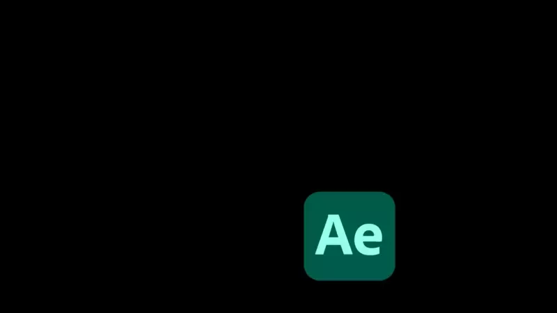
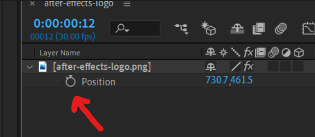
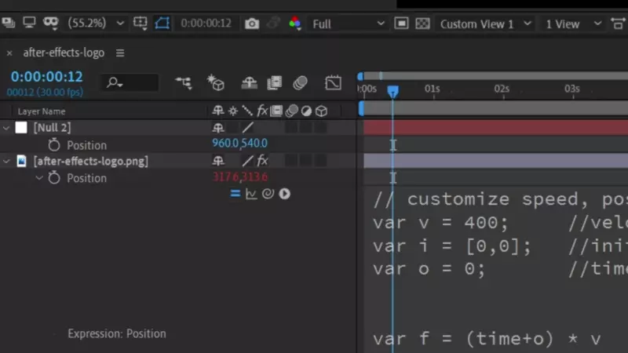

This is our goal:




## Create an expression

Add the element you want bouncing around to your composition
Find the position property (shortcut is `P`)
Hold `Alt/Option` and click the stopwatch to create an expression


## Paste in the code
Copy Paste this code into the expression window that appears  
Customize your effect with the first three variables `(v, i, o)`

```javascript
// customize speed, position and offset here
var v = 400;     //velocity
var i = [0,0];   //initial position
var o = 0;       //time offset


var f = (time+o) * v                  //function
var t = [i[0]+f, i[1]+f];             //time x/y
var d = thisLayer.sourceRectAtTime(); //dimensions
var s = transform.scale;              //scale
var lw = d.width *(s[1]/100);         //layer width
var lh = d.height*(s[0]/100);         //layer height
var w = thisComp.width - lw;          //screen width
var h = thisComp.height - lh;         //screen height

// cycle count in x and y
var c = [Math.floor(t[0]/w), Math.floor(t[1]/h)];

// position in cycle for x and y
var p = [t[0] % w, t[1] % h]

//     cycle isOdd ? inversed : original      
var x = c[0] %2==1 ? w - p[0] : p[0];
var y = c[1] %2==1 ? h - p[1] : p[1];

[x + lw/2, y + lh/2]
```

## Custom start position

Create a null that will hold our starting position and open it's position property.
Select the square brackets and parent it to the nulls position.
Now if you move the Null around at `0 seconds` the logo will follow.





## Color change on bounce
Since After Effects expressions can not remember state this is tricky.
Start by adding the `Color Balance (HLS)` effect to the logo.  
Same as before add an expression by holding Alt/Option on the effects hue property.
Copy paste this code, where the last part has been altered to work with hue.

Note that this doesn't work with our custom start position! More on this bellow.

```javascript
// REMEMBER TO MATCH BOTH EXPRESSIONS! 
var hueShift = 50 //hue shift
var v = 400;      //velocity
var i = [0,0];    //initial position
var o = 0;        //time offset

var f = (time+o) * v                  //function
var t = [i[0]+f, i[1]+f];             //time x/y
var d = thisLayer.sourceRectAtTime(); //dimensions
var s = transform.scale;              //scale
var lw = d.width *(s[1]/100);         //layer width
var lh = d.height*(s[0]/100);         //layer height
var w = thisComp.width - lw;          //screen width
var h = thisComp.height - lh;         //screen height

// cycle count in x and y
var c = [Math.floor(t[0]/w), Math.floor(t[1]/h)];

var bounces = c[0] + c[1]
bounces * hueShift
```

## Keeping both expression in sync
If you change any property in one expression you must do the same for the other!
If `initial position` is paired to the null for position, it must also be done for Hue.

*Pro tip:*
Apply the `Slider Control` effect to your element and rename it to `velocity slider`.
Pair the velocity property (`i`) for both expression to the slider, now the speed is always in sync.

## When does it perfectly loop?
Click this [link](https://codepen.io/jesper-hustad/pen/LYQpWEL?editors=0010) for a CodePen with some javascript code that finds the next loop frame and a timestamp. You will need to manually put in your data points so it isn't perfect. Unfortunately i couldn't find an easy way to do this in After Effects because it crashes. If anyone knows a way to run a resource intensive expression once please share!  


## Enjoy the nostalgia
Now you have your very own bouncing logo effect, taste that sweet sweet nostalgia!.


