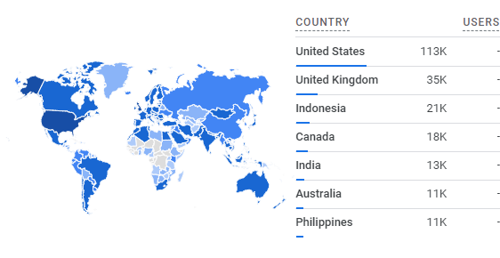
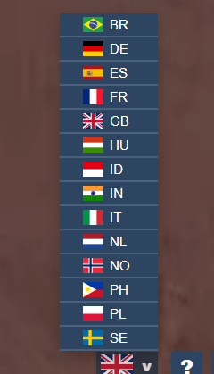

This is a retro perspective of a website based of a Grand Theft Auto Minigame. A quickly done project that currently has over two hundred thousand visitors from all over the world. 

It came with a lot of lessons. Language support, responding to bugs, and trying to follow some newly learned best coding practices.

[Link to GitHub repo](https://github.com/Jesper-Hustad/NoPixel-minigame/tree/main/src)   

**[Demo](https://jesper-hustad.github.io/NoPixel-minigame/index)**   

## The Story
On March 24th 2021 I made the website over a weekend. It was the second year studying for my Computer Science bachelors. I saw it as a fun learning opportunity. 

The Minigame is played in a version of [Grand Theft Auto Five](https://en.wikipedia.org/wiki/Grand_Theft_Auto_modding). If you succeed there is a big reward, but it's difficult and you only get one try. The idea of the website is to let you train on the Minigame with additional helpful features like slowing down the timer.  

The code wasn't my best work. Made in one sitting, with the expectation that only a few would ever see it. There was a lot of SVG (Scalable Vector Graphic) editing required. It's all written in raw HTML.

I forgot about the project, but later noticed an increase in activity. It had been found by some key personalities in the online community. Later streamers such as [xQc](https://en.wikipedia.org/wiki/XQc) and [Pokimane](https://en.wikipedia.org/wiki/Pokimane) among other live streamers would use the site which lead to growth. With this came an onslaught of users and subsequently bug reports and feature requests.

**Changelog trough commits:**  
- added Archivo font for better support on macs  
- made mock loading shorter  
- Added puzzle time slider  
- Display answer after failing  
- Help page  
- Fix first never selected #5  
- Added color text question #8  
- Added FiveM docs to README  
- Fix #26 https

## Language support
From the helpful google analytics I could see there where a lot of international users. I also got feedback from users about wanting language support. Using the data I added languages for the biggest demographics.

Interesting little story here. For Portuguese I thought it was natural to use the flag of Portugal. But the website actually has more users from brazil. And when a Pull Request was sent in with language improvements for Portuguese they wanted to set the flag to Brazil

**#59 victordib:** Since there are some minor changes in the language, i updated the file to show only BR!

Funny example of how real-world politics seeps into coding projects. I have no opinion on the matter, so until someone comes in with arguments for changing it back it will be left with Brazilian flag for Portuguese.  

Maybe the true lesson is to just never use flags.

**Language feature**  

## Accessibility

**#50 Creeamy:** Please make this Colorblind Friendly  

>If you have some sort of colorblindness like me (red/green) doing the [minigame] can be impossible sometimes because the colors red/orange/yellow are really hard to differentiate and so you fail it simply because you can't tell which one is which ...

From my experience in print graphics I take readability seriously. So when I found out that the website was not colorblind friendly that was a high priority issue.

Interesting how an over-the-weekend project can suddenly cause real issues like this. Definitely a valuable lesson to take into future projects.

## Coding experience  
I never expected this to be seen by anyone. It may sound dumb, but when it got users I seriously felt ashamed knowing that all those pull requests meant people had to interact with my code.

*src:*  
>helpers.js  
language.js  
puzzle-factory.js  
puzzle-handler.js  
script.js  
svg-factory.js  
translator.js  

I did some refactoring. Didn't want to change to much to hurt the other devs helping with pull requests. Shows how difficult it is to make changes once it's out there.

You can see me being inspired by the coding practices being thought in my classes.  

Two factories! That must mean it's good. 

## Conclusion  
A better understanding of how a project grows. Once it was discovered by enough people the user base grew by itself. 

The importance of usability.   

Listening to user feedback.  

Especially with the language support. Without the hotfixes and improvements I don't believe it would have grown as it did at all. 

