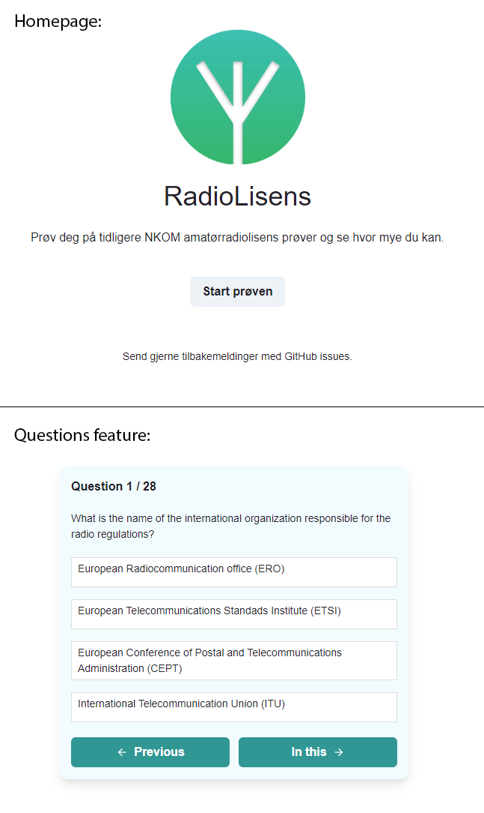

Met some people at a bar while studying in Trondheim that where in an Amateur Radio Club. I had always found the idea interesting. After a couple of drinks I was invited to get my very own license. 

I found that the resources for practicing where pretty scarce for the Norwegian license. So the idea of a simple website dedicated for amateur radio was born.


When preparing for my [(very expensive)](https://en.wikipedia.org/wiki/Driving_licence_in_Norway#Cost) Norwegian driving license I trained with an app. Using the mobile interface was vastly superior in that case. 

For this reason special care into making the website "installable" for mobile users. Since I wasn't about to spend the money on App stores a [PWA](https://en.wikipedia.org/wiki/Progressive_web_app) would do.

Image of RadioLisens website:  


[Link to website](https://jovial-mcnulty-402595.netlify.app/)


## Tech  
Used Gatsby and Netlifly for hosting.


I wanted to make sure the website was working well on mobile. I saw that as where most users would be using it. So being able to install it as an app is important.


## Data Scraping
To get the data of example questions I used old previous exams. Wrote a simple script to convert that data to JSON. 

```javascript
const fs = require("fs");
const examDirectory = "./previousExams/"
const fileToQuestions = (fileName) => fs.readFileSync(examDirectory + fileName).toString().split("Question text")

const toQuestionObject = (rawQuestion) => {
    const s = rawQuestion.split("\n")
    const i = s.indexOf('a.')
    const c = s[s.indexOf('Feedback') + 1].substring(23)
    const answers = [s[i+1],s[i+4],s[i+7],s[i+10]]
    const solution = answers.indexOf(c)

    return { "question" : s[1], "answers" : answers, "solution" : solution}
}

const exams = fs.readdirSync(examDirectory)
const questions = exams.map(f => fileToQuestions(f).map(toQuestionObject)).flat()
fs.writeFileSync("questions.json", JSON.stringify(questions));
```

## Reflections  
This was a good project to test out React and Gatsby. Learned how URLs redirects worked with Netlify hosting.  

If I where to implement this again I would forgo React because this site is to simple for it. 

Playing with functional code was fun. I remember using Kotlin a lot for *Algorithm and Data structure* assignments. I can see that inspiration in the shuffle function.

**Shuffle Question Function**
```
function getShuffled(arr, max){
    return arr
            .map(value => ({ value, sort: Math.random() }))
            .sort((a, b) => a.sort - b.sort)
            .map(({ value }) => value)
            .slice(0,max)
}
```

The people in my class found it helpful. But without any specialized features that relate to amateur radio there are better websites that focus on "multiple choice question" features.

For example some cool animations or interactive radio features would make this website unique and could give it a competitive edge. But after all that is said and done it was still a fun project