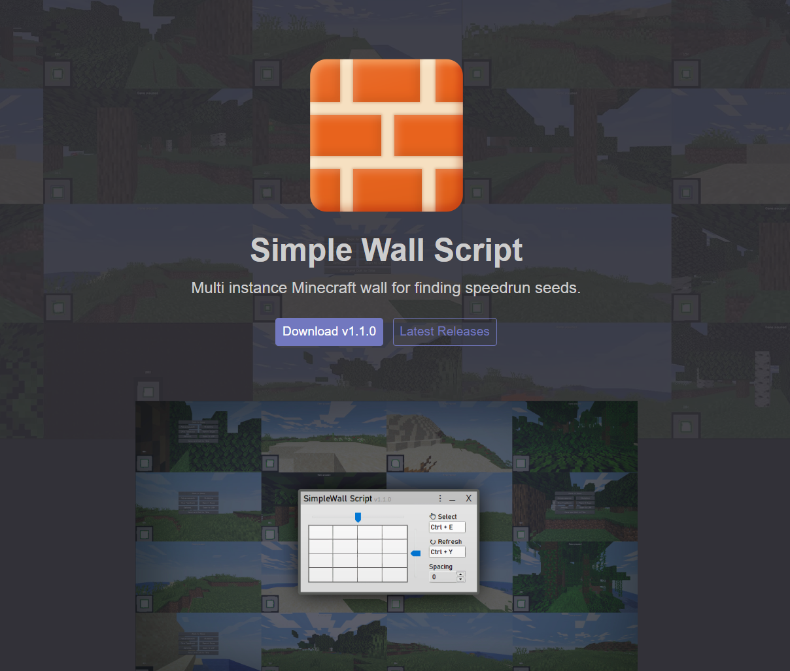

This is a AutoHoyKey macro program used for Minecraft speedruns.  

[Wikipedia page on Minecraft:](https://en.wikipedia.org/wiki/Minecraft#Applications)  
>Despite its unpredictable nature, Minecraft has become a popular game for speedrunning, where players time themselves from being dropped into a new world to reaching The End and defeating the Ender Dragon boss. Some speedrunners use a combination of mods, external programs, and debug menus, while other runners play the game in a more vanilla or more consistency-oriented way

This is a program for that use case. It allows users to load the game multiple times simultaneously to find better starting conditions.

[Demo link to website](https://jesper-hustad.github.io/SimpleWallScript/)

## Lessons learned   
From my previous projects I learned the importance of kickstarting a project for users. So I made a [short 100 second video](https://www.youtube.com/watch?v=724f_UML564) about how to setup the program. This got 16.000 views with a lot of positive reactions in the comments.

- **danglee4291:** Thanks so much man, this video was put together so simply. I was able to have [the program] up in 5 mins from this video.

- **bxnju644:** Wow, concise and works perfectly. 200 times better than all the other methods

- **Admin-dv9yp:** When I saw the vid it seemed soo easy that I thought it's something skipped about how you do it or something but I literally just installed the script pressed ctrl+y and it worked. I still can't believe it😅

- **tonyking2880:** holy moly, i didn't expect that to be so easy

## Reaction from competitors 
I was not the first to think of such a program. The issue with the alternatives was that they where difficult to use. That is why I put a large emphasis on keeping the program simple and easy to setup.

I was happy to see the alternatives step up their game in making their programs more accessible and user friendly after I released mine. For example later [this video](https://www.youtube.com/watch?v=QSEkkmwjhW8) seems inspired with a similar title and start of video.

## My experience with AutoHotKey
AutoHotKey is hell. It's from 2003 and is a scripting language, not a programming language.  

So many things I take for granted with coding are not true for AHK (AutoHotKey).

*Example:*  
Normal coding language: `gui.add("slider", verticalSlider)`  
AutoHotKey: `Gui, Add, Slider,  vverticalSlider`  

You just put random letters in front of variables.

Here is the full function:
`Gui, Add, Slider,  +E0x20 0 cRed x%t6% y%tablePosY% w23 h%tableHeight% GSliderRow NoTicks Left Range1-7 Invert Vertical cBlack vverticalSlider, 2`

The functions also force you to use GOTO statements like they are going out of style.

I found out later that AutoHotKey has a V2 version that makes it into a fully fledged real programming language. It's still pretty new and there isn't much documentation available, but definitely use that if you ever need to use AHK.  

Personally I don't want to touch this script ever again with a 10ft pole.  

## Conclusions

I expanded my horizons on scripting/coding languages (for better or for worse). 

Creating the landing page for downloads was neat. Getting users to install a program includes a lot of friction, so it's cool to see that people where able to install and run it reliably.

Getting feedback on bugs and features is important. There where some big bugs in the initial versions that where fixed quickly. Later some nice creature comforts where added from the feedback.  

If the program is good it's easy to sell the solution.

Focusing on simplicity and ease of use are really valuable. Try to reduce friction wherever possible.

